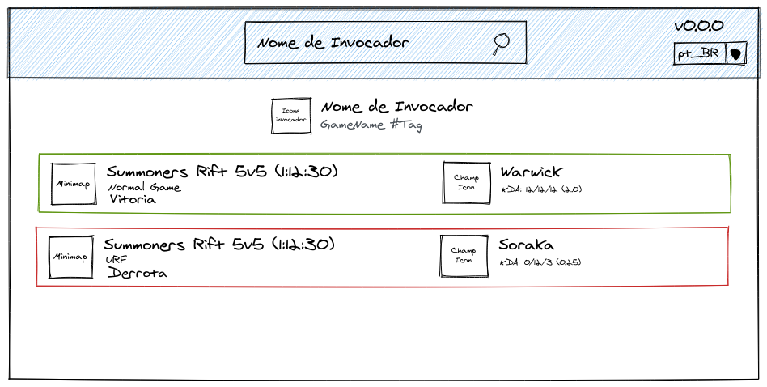

# APIs

## LoL
### Where to get data:
- Versions: https://ddragon.leagueoflegends.com/api/versions.json
- Full Doc for LoL: https://developer.riotgames.com/docs/lol
- Seasons: https://static.developer.riotgames.com/docs/lol/seasons.json
- Queue Types: https://static.developer.riotgames.com/docs/lol/queues.json
- Maps: https://static.developer.riotgames.com/docs/lol/maps.json
- Game Modes: https://static.developer.riotgames.com/docs/lol/gameModes.json
- Game Types: https://static.developer.riotgames.com/docs/lol/gameTypes.json
- Languages: https://ddragon.leagueoflegends.com/cdn/languages.json
- Champions List: http://ddragon.leagueoflegends.com/cdn/<version>/data/<language>/champion.json
- Get Specific champion: http://ddragon.leagueoflegends.com/cdn/<version>/data/<language>/champion/<champion-id>.json
- Champion Loading screen asset: http://ddragon.leagueoflegends.com/cdn/img/champion/loading/<champion-id>_<skin-number>.jpg
- Champion Square Asset: http://ddragon.leagueoflegends.com/cdn/<version>/img/champion/<champion-id>.png
- Champ Passive skill data: http://ddragon.leagueoflegends.com/cdn/<version>/img/passive/<asset-name>.png
> This `<asset-name>` field can be found at `passive`->`full` field in the champion details
- Ability assets: http://ddragon.leagueoflegends.com/cdn/<version>/img/spell/<hability-name>.png
> Get this `<hability-name>` value from champion details data
- Item List: http://ddragon.leagueoflegends.com/cdn/<version>/data/<language>/item.json
- Item image: http://ddragon.leagueoflegends.com/cdn/<version>/img/item/<item-id>.png
- List Summoner spells: http://ddragon.leagueoflegends.com/cdn/<version>/data/<language>/summoner.json
- Get Summoner spell: http://ddragon.leagueoflegends.com/cdn/<version>/img/spell/<spell-id>.png
- List Profile Icons: http://ddragon.leagueoflegends.com/cdn/<version>/data/<language>/profileicon.json
- Get profile icon: http://ddragon.leagueoflegends.com/cdn/<version>/img/profileicon/<icon-id>.png
- Get Minimap asset: http://ddragon.leagueoflegends.com/cdn/<version>/img/map/<map-id>.png

### What do we need

- File to store platform and host relations
- File to store region and hosts
- API Key to perform actions

## To do
- [ ] Get assets during startup
- [ ] Store all necessary data to show up stuff in the frontend

# Mockup

